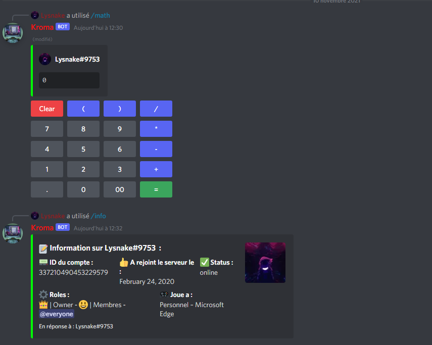

# 🤖 Kroma-bot 🤖 

### Voici une majeure partie du code du bot Kroma, des parties vont rester confidentiels
&nbsp; Vous pouvez retrouver le projet sous la version v12 de Discord.js dans une des branches.  
&nbsp; Le projet est adapté et fonctionnel uniquement pour le discord **Kroma' Discord**  
&nbsp; Vous pouvez utiliser certaines parties pour votre bot (adapter en fonction du serveur discord)

---

## Table des matières
* [Informations générales](#informations-générales)
* [Technologies utilisées](#technologies-utilisées)
* [Fonctionnalités](#fonctionnalités)
* [Screenshots](#screenshots)

---

## Informations générales
- Ce code est destiné uniquement pour le bot **Kroma**, cependant vous pouvez réutiliser et adapter certaines parties à votre projet.
- Le projet n'est pas terminé, il me reste plusieurs fonctionnalitées à mettre à jour.
- Il reste de potentiel bugs (extrement rare) qui peuvent provoquer un crash.

## Technologies utilisées
Ce projet utilise comme technologies :
- [Node.js](https://nodejs.org/fr/) - Environnement d’exécution
- [Discord.js](https://discord.js.org/#/) - Module Node.js permettant l'interaction avec l'api Discord

## Fonctionnalités
| Fonctionnalités        | Discord.js V12     | Discord.js V13 | Slash commandes |
| - |:-:|:-:|:-:|
| **User info / server info / bot info**  	| :white_check_mark:	| :white_check_mark:	| :white_check_mark:	|
| **Calculatrice Math**  	| :white_check_mark:	| :white_check_mark: 	| :white_check_mark:	|
| **Calcul pourcentage**  	| :white_check_mark: 	| :x: | :x: |
| **Stats COVID19** 	| :white_check_mark: | :white_check_mark: | :x:	|
| **Quizz informatique**  	| :white_check_mark: 	|  :white_check_mark: 	| :white_check_mark:	|
| **Traduction langage** 	| :white_check_mark:	| :white_check_mark: 	| :x:	|
| **Météo**  	| :white_check_mark:	| :white_check_mark: 	| :x:	|
| **Wikipedia**  	| :white_check_mark: 	| :white_check_mark: 	| :x:	|
| **YouTube** 	| :white_check_mark: 	| :white_check_mark:	| :white_check_mark:	|
| **Mute / Unmute / Tempmute** 	| :white_check_mark: |  :white_check_mark:	| :white_check_mark:	|
| **Warns / delwarns / seewarns**	| :white_check_mark: 	| :x:	| :x:	|
| **Slowmode**	| :white_check_mark: 	| :white_check_mark:	| :white_check_mark:	|
| **Sondage**	| :white_check_mark: 	| :white_check_mark:	| :white_check_mark:	|
| **Musique** 	| :white_check_mark: 	| :white_check_mark: | :x: |
| **Twitch stats**	| :white_check_mark:	| :white_check_mark: | Impossible |
| **Canvas welcome**	| :white_check_mark:	| :x:	| Impossible |
| **Captcha** 	| :white_check_mark:| :x: | Impossible |

## Screenshots

